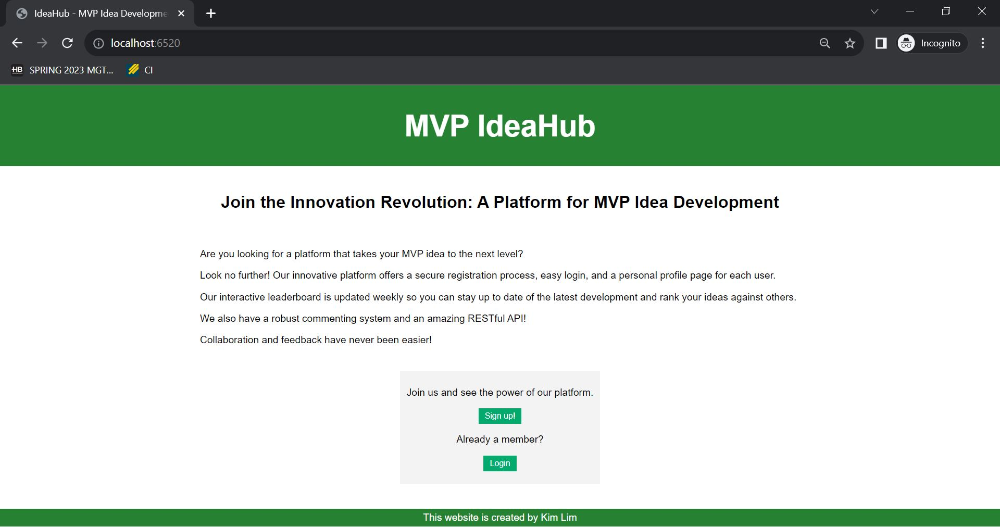
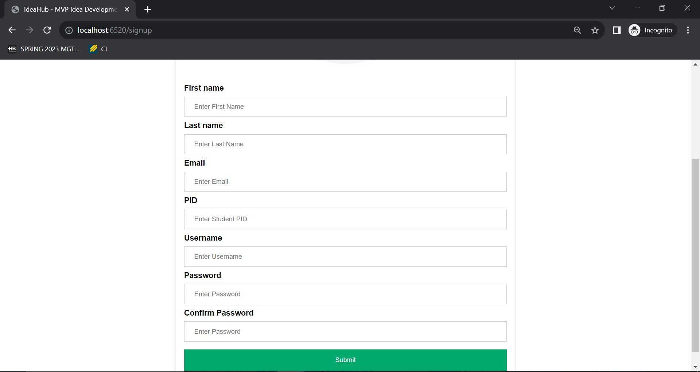
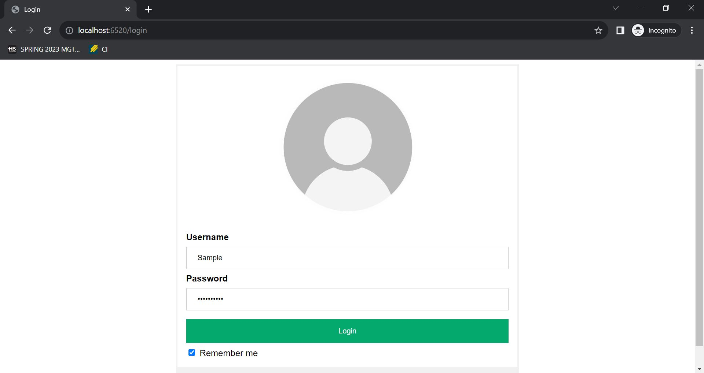
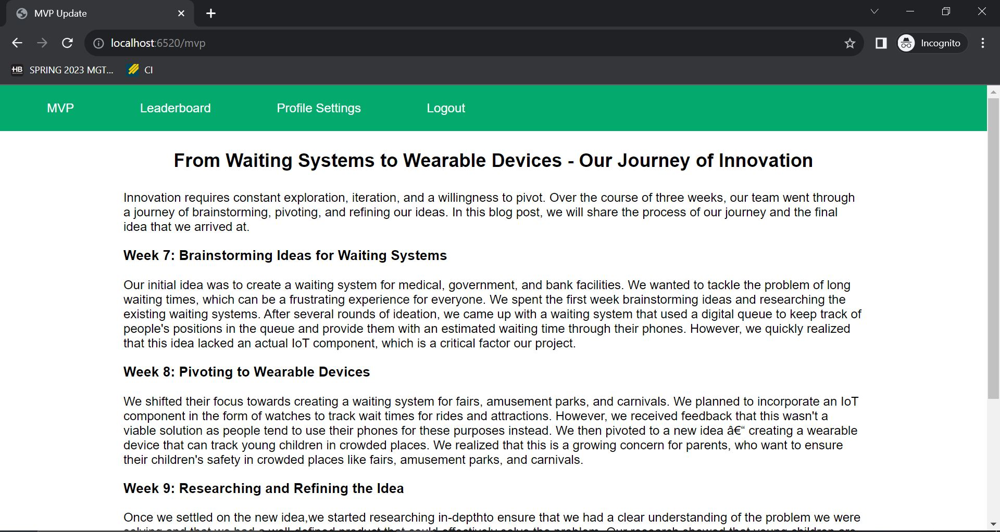
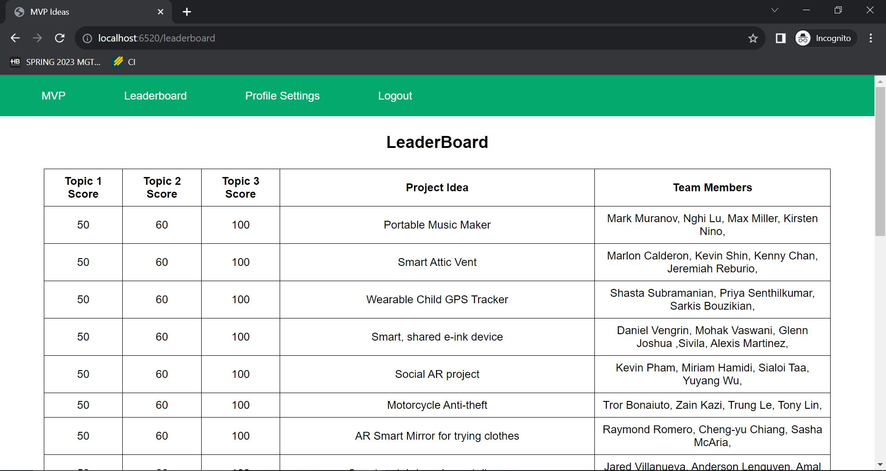
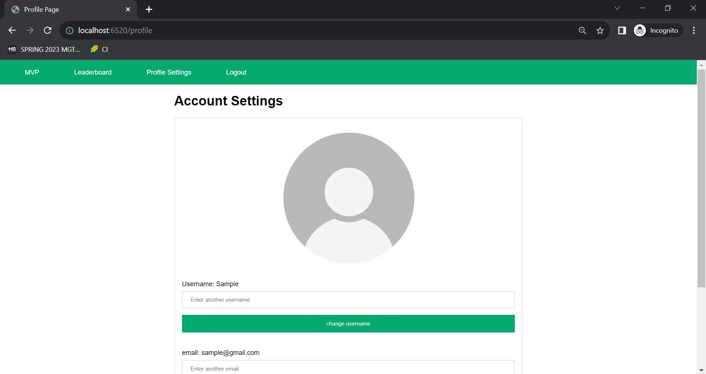

Welcome to the MVP Ideation repository. This repository contains the source code for a FastAPI web application, which serves a simple social network for users to view different mvp ideas. It allows 
users to sign up, log in, view profiles, view leaderboards, and update their MVPs. It also supports authentication and 
authorization using JWT tokens. The project uses a MySQL database to store user information.

Here is a helpful visualization of how the website looks like:

#### Homepage:   

#### Sign up Page:   

#### Login Page:     

#### User's MVP Page:        

#### Leaderboard Page:       

#### Profile Settings Page:      

### Prerequisites:   
Python 3.x installed    
pip package manager installed   
MySQL server installed  

## Technologies Used

FastAPI: A modern, fast (high-performance) web framework for building APIs 
with Python.

MySQL: A popular open-source relational database management system.

HTML and CSS: Used for creating the user interface of the web application.

JavaScript: Used for handling dynamic interactions on the client-side.

## Installation

1. Clone the repository:

   In your IDE's terminal run the following command:

    ``
    git clone <repository-url>
    ``

2. Make sure to have the following packages:
   - fastapi
   - uvicorn
   - mysql.connector
   - dotenv
   
   If you don't, run the following in the command line:

   ``
   pip install fastapi uvicorn mysql-connector-python python-dotenv
   ``

3. Set up the MySQL database:

   Make sure you have MySQL installed and running on your system.

   - In your IDE, create a new file and name it credentials.env
   - In it, have the following:

        MYSQL_HOST = 127.0.0.1         
        MYSQL_USER = <your_mysql_username>     
        MYSQL_PASSWORD = <your_mysql_password>  
        MYSQL_DATABASE = leaderboard 
    - Create the necessary database tables by  running the following command.  
    `` py init_db.py`` 
    - This will create the necessary tables for you.

4. Run the application:

   If running from terminal, run the following command:

   ``
   py server.py
   ``
   

5. Access the application in your browser:

   In your web browser, type in: 

   `localhost:6520` to access homepage   

### Usage   
The following endpoints are available in the application:

/ - Home page   
/login - Log in page    
/signup - Sign up page  
/profile - User profile page 
/mvp - MVP update page  
/leaderboard - Leaderboard page 

The application uses JWT tokens for authentication and authorization. When a user logs in, a token is generated and 
returned to the client. This token must be included in the Authorization header of subsequent requests that require 
authentication.